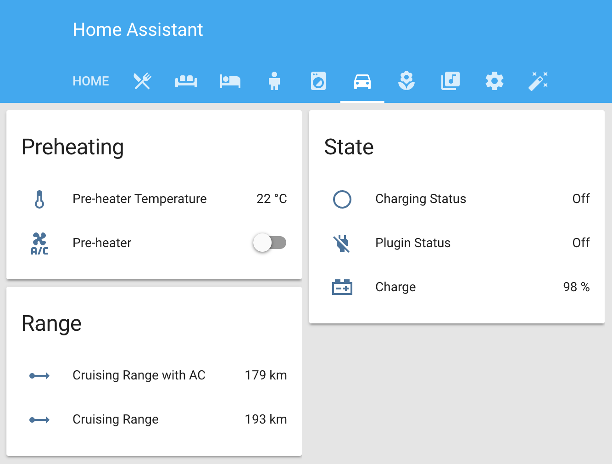

# Carwings Hass.io add-on

Quite frankly I wish someone made a 'proper' Carwings add-on for Hass.io in python, but as I could wait no longer, I threw this together in nodejs.

## Configure Hass.io to consume MQTT messages
```
switch:
  - platform:              mqtt
	name:                  Leaf Pre-heater
	command_topic:         "cmnd/carwings/ac"
	state_topic:           "tele/carwings"
	value_template:        '{{ value_json.RemoteACState }}'
	payload_on:            'ON'
	payload_off:           'OFF'

sensor:
  - platform:             mqtt
	state_topic:          'tele/carwings'
	name:                 'leaf_soc'
	unit_of_measurement:  '%'
	value_template:       '{{ value_json.SOC }}'
  - platform:             mqtt
	state_topic:          'tele/carwings'
	name:                 leaf_cruising_range_ac_on
	friendly_name:        'Crusing Range AC'
	unit_of_measurement:  'km'
	value_template:       '{{ value_json.CruisingRangeAcOn | multiply(0.001) | round(0) }}'
  - platform:             mqtt
	state_topic:          'tele/carwings'
	name:                 leaf_cruising_range_ac_off
	friendly_name:        'Crusing Range'
	unit_of_measurement:  'km'
	value_template:       '{{ value_json.CruisingRangeAcOff | multiply(0.001) | round(0) }}'
  - platform:             mqtt
	state_topic:          'tele/carwings'
	name:                 leaf_preheat_temp
	friendly_name:        'Preheat Temperature'
	unit_of_measurement:  '°C'
	value_template:       '{{ value_json.PreAC_temp }}'

binary_sensor:
  - platform:           mqtt
	state_topic:        'tele/carwings'
	name:               leaf_charging_status
	friendly_name:      'Charging Status'
	value_template:     '{{ value_json.isBatteryCharging }}'
  - platform:           mqtt
	state_topic:        'tele/carwings'
	name:               leaf_plugin_status
	friendly_name:      'Plugin Status'
	device_class:       plug
	value_template:     '{{ value_json.isPluggedin }}'
```

